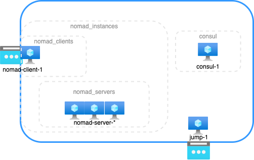

# consul-nomad-example

This repository creates a simple datacenter of [Consul](https://www.consul.io/) and [Nomad](https://www.nomadproject.io/)
in [Microsoft Azure](https://azure.microsoft.com/) with [Terraform](https://www.terraform.io/) and [Ansible](https://docs.ansible.com/). 
And there is a example nomad job which runs an nginx server for demo.



## Setup steps

1. Use terraform to create infra in azure.

    Under `terraform` directory is scripts that defines infrastructure of our example datacenter.
    The only mandatory variable to set is `resource_group_name`, which to create a resource group under your subscription. 
    And other variables can be referenced in variables.tf.

```
$ terraform init
$ terraform apply -var="resource_group_name=<your-rg-name>"
...
Outputs:

jump_ip_addr = "<ip of your datacenter baston>"
nomad_client_ip_addr = "<public ip for your nomad client>"
```

1. Use ansible to install package and set up configuration of consul and nomad.

    Under `ansible` directory is playbooks of our example datacenter. 
    The only value must to be set is `jump_host` if you did not change terraform's setting.
    You may pass the value through `--extra-vars`:

```
$ ansible-galaxy install -r requirements.yaml
$ ansible-playbook main.yml --extra-vars "ansible_user=poyu jump_host=<ip of your datacenter baston>"
```

1. Deploy a job to your clusters.

    Under `jobs` directory is a example nomad job which runs an nginx server. 

```
$ ssh -A -NfL 10001:nomad-server-1:4646 <ip of your datacenter baston>
$ export NOMAD_ADDR=http://127.0.0.1:10001
$ nomad job plan example.nomad
...
nomad job run -check-index 0 example.nomad
...
$ nomad job run -check-index 0 example.nomad
...
==> Evaluation "XXXX" finished with status "complete"
# Test
$ curl <public ip for your nomad client>/consul.html
consul servers list:

10.0.1.8:8300
```